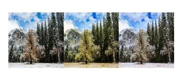

# A Readable Implement of GANs using Pytorch

- Pix2Pix [[paper(2016)]](https://arxiv.org/abs/1611.07004) 
  - facades [[ipynb]](pix2pix.ipynb) [[colab]](https://drive.google.com/file/d/1UkeibuysuzYWGe8ovEJC3M5T7iCPXg-R/view?usp=sharing)
  
  

- GAN [[paper(2014)]](https://papers.nips.cc/paper/5423-generative-adversarial-nets.pdf) 
  - fullyconnected-mnist [[ipynb]](plain_GAN.ipynb) [[colab]](https://drive.google.com/file/d/1goC0f3jWCw8oucUZ-Ys6gGOL3UNaV6AV/view?usp=sharing)
  
    

- WGAN [[paper(2017)]](https://arxiv.org/abs/1701.07875) 
  - fullyconnected-mnist [[ipynb]](WGAN.ipynb)
  
    
  
  - fullyconnected-mnist-with-L2-regularization [[ipynb]](WGAN_w_Reg.ipynb)
  
  

- CycleGAN [[paper(2017)]](https://arxiv.org/abs/1703.10593) 
    - mnist2svhn [[ipynb]](cycleGAN_28x28.ipynb) [[ipynb_2]](cycleGAN_28x28_1.ipynb)
   
  
    
  
    - summer2winter [[ipynb]](cycleGAN_256x256.ipynb)

  
  
